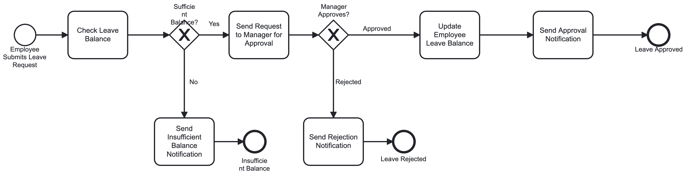
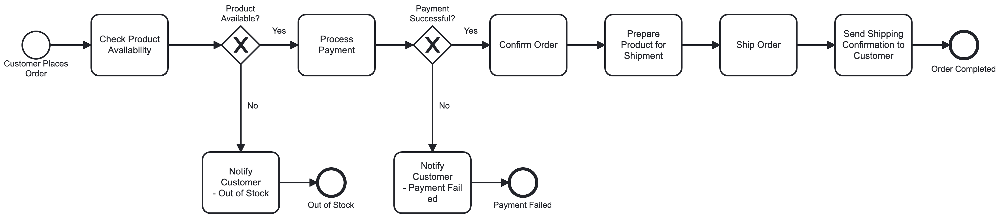
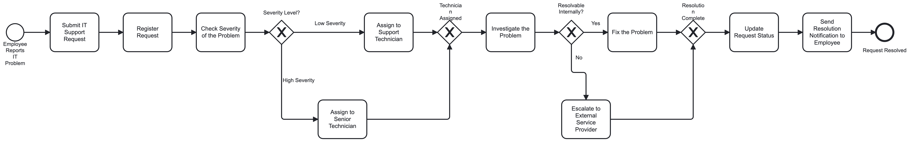

# BPMN Process Modeling Assignment(ALL BPMN files are inside bpmn folder and the screenshots are in readme and in images folder)

This repository contains three BPMN process models built for Camunda Modeler, covering three business scenarios: employee leave approval, online purchase order processing, and IT service request handling.

## Scenario 1: Employee Leave Approval

### Process Description
An employee applies for leave through the HR system. The system first checks whether the employee has enough leave balance before routing the request to a manager for a decision.

### Flow Logic
1. **Start Event** – "Employee Submits Leave Request" triggers the process.
2. **Task** – "Check Leave Balance": the HR system verifies available balance.
3. **Exclusive Gateway** – "Sufficient Balance?"
   - **No** → **Task** "Send Insufficient Balance Notification" → **End Event** "Insufficient Balance".
   - **Yes** → **Task** "Send Request to Manager for Approval".
4. **Exclusive Gateway** – "Manager Approves?"
   - **Approved** → **Task** "Update Employee Leave Balance" → **Task** "Send Approval Notification" → **End Event** "Leave Approved".
   - **Rejected** → **Task** "Send Rejection Notification" → **End Event** "Leave Rejected".

### Why it's modeled this way
There are two decision points (balance check, manager decision), each represented by an **Exclusive Gateway** since only one outgoing path can be taken. The process has three distinct terminations (approved, rejected, insufficient balance), so it uses **three separate End Events** rather than merging outcomes — this keeps each end state clearly traceable, which is good BPMN practice when outcomes are semantically different.

---

## Scenario 2: Online Purchase Order Processing

### Process Description
A customer places an online order. The system checks stock availability and processes payment before confirming and shipping the order.

### Flow Logic
1. **Start Event** – "Customer Places Order".
2. **Task** – "Check Product Availability".
3. **Exclusive Gateway** – "Product Available?"
   - **No** → **Task** "Notify Customer - Out of Stock" → **End Event** "Out of Stock" (process ends here).
   - **Yes** → **Task** "Process Payment".
4. **Exclusive Gateway** – "Payment Successful?"
   - **No** → **Task** "Notify Customer - Payment Failed" → **End Event** "Payment Failed" (process ends here).
   - **Yes** → **Task** "Confirm Order" → **Task** "Prepare Product for Shipment" → **Task** "Ship Order" → **Task** "Send Shipping Confirmation" → **End Event** "Order Completed".

### Why it's modeled this way
This scenario has **two independent decision points**, each capable of ending the process early (out of stock, payment failure) — demonstrating **multiple process paths** as required. Only orders that pass both checks proceed through the full fulfillment chain (confirm → prepare → ship → notify), shown as a straight sequential path since no further branching is needed after payment succeeds.

---

## Scenario 3: IT Service Request

### Process Description
An employee reports an IT problem. The help desk registers and triages it by severity, assigns it to the right technician tier, and routes it internally or externally depending on whether it can be resolved in-house.

### Flow Logic
1. **Start Event** – "Employee Reports IT Problem".
2. **Task** – "Submit IT Support Request".
3. **Task** – "Register Request" (help desk logs the ticket).
4. **Task** – "Check Severity of the Problem".
5. **Exclusive Gateway** – "Severity Level?"
   - **Low Severity** → **Task** "Assign to Support Technician".
   - **High Severity** → **Task** "Assign to Senior Technician".
   - Both paths **converge** at a merging Exclusive Gateway before continuing (a technician has now been assigned, regardless of tier).
6. **Task** – "Investigate the Problem".
7. **Exclusive Gateway** – "Resolvable Internally?"
   - **Yes** → **Task** "Fix the Problem".
   - **No** → **Task** "Escalate to External Service Provider".
   - Both paths **converge** again at a second merging Exclusive Gateway (resolution has been reached either way).
8. **Task** – "Update Request Status".
9. **Task** – "Send Resolution Notification to Employee".
10. **End Event** – "Request Resolved".

### Why it's modeled this way
This scenario needed **two separate exclusive decisions** (severity level, then resolvability), each with genuinely alternative paths that later rejoin the main flow — so **converging Exclusive Gateways** are used to bring both branches back into a single path before the final steps (status update + notification), since regardless of *which* technician resolved it or *how*, the closing steps are identical. This avoids duplicating the "Update Status → Notify → End" tasks on every branch.

---

## Notes on Modeling Choices

- All gateways used are **Exclusive Gateways (XOR)** since every decision point in these scenarios has mutually exclusive outcomes (only one path is ever taken).
- Sequence flows leaving a gateway are labeled (e.g., "Yes"/"No", "Low Severity"/"High Severity") to make the decision logic self-explanatory when viewed in Camunda Modeler.
- Processes are marked `isExecutable="false"` since these are conceptual/documentation models (no service implementations, forms, or connectors attached) — they can be switched to executable and enriched with Camunda-specific attributes (e.g., `camunda:assignee`, forms, DMN) if the assignment later requires deployment.
- Each model was validated as well-formed BPMN 2.0 XML before submission.